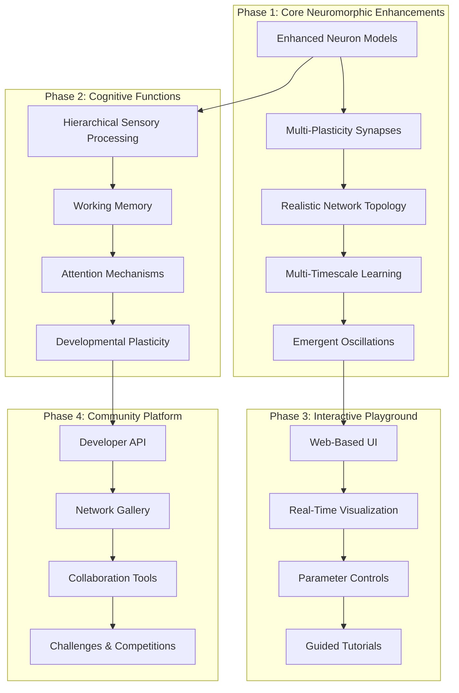

# Design Document: Enhanced Neuromorphic Brain Learning

## Overview

This design transforms the current Coherence neuromorphic framework into a more biologically realistic and developer-friendly brain learning simulation. Building on the successful balanced competitive learning foundation (100% concept accuracy, 0.986 attractor stability), we'll enhance biological realism while maintaining accessibility for non-neuroscientist developers.

The design follows a phased approach to manage complexity and ensure each phase delivers tangible value to the community.

## Architecture

### High-Level System Architecture



### Core Components

#### 1. Enhanced Neuron Engine (`core/enhanced_neurons.py`)

**Purpose**: Extend current neuron models with diverse, realistic behaviors

**Key Features**:
- **Multiple Firing Patterns**: Regular spiking, fast spiking, bursting, chattering
- **Spike-Frequency Adaptation**: Realistic adaptation with multiple time constants
- **Neuron Type Diversity**: Excitatory (pyramidal, spiny stellate) and inhibitory (basket, chandelier, Martinotti)
- **Intrinsic Properties**: Resonance, bistability, rebound excitation

**Implementation Strategy**:
```python
class EnhancedNeuronModel(NeuronModel):
    def __init__(self, neuron_type: str, adaptation_strength: float = 0.1):
        self.neuron_type = neuron_type  # 'RS', 'FS', 'IB', 'CH', etc.
        self.adaptation_current = 0.0
        self.adaptation_tau = self._get_adaptation_params(neuron_type)
        
    def step(self, dt: float, I_syn: float) -> bool:
        # Enhanced dynamics with adaptation and type-specific behaviors
        self._update_adaptation(dt)
        return super().step(dt, I_syn - self.adaptation_current)
```

#### 2. Multi-Plasticity Synapse System (`core/enhanced_synapses.py`)

**Purpose**: Implement multiple interacting forms of synaptic plasticity

**Key Features**:
- **Concurrent Plasticity**: STDP + homeostatic + metaplasticity running simultaneously
- **Neuromodulation**: Dopamine-modulated learning rates based on reward
- **Saturation Effects**: Realistic upper/lower bounds with competition
- **Multi-Timescale**: Fast (seconds) and slow (hours) plasticity components

**Implementation Strategy**:
```python
class MultiPlasticitySynapse(Synapse):
    def __init__(self):
        self.stdp_component = STDPPlasticity()
        self.homeostatic_component = HomeostaticPlasticity()
        self.metaplasticity_component = MetaPlasticity()
        self.dopamine_level = 1.0
        
    def update_weight(self, pre_spike: bool, post_spike: bool, dt: float):
        # Combine multiple plasticity mechanisms
        delta_w = (
            self.stdp_component.compute_change(pre_spike, post_spike, dt) * self.dopamine_level +
            self.homeostatic_component.compute_change(self.weight, dt) +
            self.metaplasticity_component.modulate_learning_rate()
        )
        self.weight = self._apply_bounds(self.weight + delta_w)
```

#### 3. Realistic Network Builder (`core/brain_topology.py`)

**Purpose**: Create brain-inspired network architectures with realistic connectivity

**Key Features**:
- **Distance-Dependent Connectivity**: Connection probability decreases with distance
- **Small-World Properties**: High clustering, short path lengths
- **Excitatory/Inhibitory Balance**: 80/20 ratio with appropriate connectivity patterns
- **Modular Structure**: Distinct modules with sparse inter-module connections

**Implementation Strategy**:
```python
class BrainTopologyBuilder:
    def create_cortical_network(self, size: int, modules: int = 4):
        # Create modular structure
        module_size = size // modules
        network = NeuromorphicNetwork()
        
        for i in range(modules):
            # Create module with E/I balance
            exc_neurons = int(module_size * 0.8)
            inh_neurons = int(module_size * 0.2)
            
            network.add_layer(f"exc_module_{i}", exc_neurons, "enhanced_pyramidal")
            network.add_layer(f"inh_module_{i}", inh_neurons, "enhanced_basket")
            
            # Intra-module connectivity
            self._connect_module(network, i, connection_prob=0.1)
            
        # Inter-module connectivity
        self._connect_modules(network, modules, connection_prob=0.01)
        
        return network
```

#### 4. Oscillation Generator (`core/neural_oscillations.py`)

**Purpose**: Generate brain-like oscillations that emerge from network dynamics

**Key Features**:
- **Gamma Oscillations**: 30-100 Hz from E/I interactions
- **Theta Rhythms**: 4-8 Hz from inhibitory networks
- **Plasticity Modulation**: Oscillations gate synaptic plasticity
- **Cross-Region Coherence**: Synchronized oscillations between areas

**Implementation Strategy**:
```python
class OscillationAnalyzer:
    def __init__(self, network: NeuromorphicNetwork):
        self.network = network
        self.frequency_bands = {
            'theta': (4, 8),
            'alpha': (8, 13),
            'beta': (13, 30),
            'gamma': (30, 100)
        }
        
    def analyze_oscillations(self, spike_data: np.ndarray, dt: float):
        # Compute power spectral density
        frequencies, power = self._compute_psd(spike_data, dt)
        
        # Extract oscillation metrics
        oscillation_metrics = {}
        for band, (low, high) in self.frequency_bands.items():
            band_power = self._extract_band_power(frequencies, power, low, high)
            oscillation_metrics[band] = band_power
            
        return oscillation_metrics
```

#### 5. Sensory Processing Hierarchy (`core/sensory_hierarchy.py`)

**Purpose**: Implement hierarchical sensory processing with feature extraction

**Key Features**:
- **Visual Processing**: Edge detection → orientation → motion → objects
- **Auditory Processing**: Frequency analysis → temporal patterns → recognition
- **Multi-Modal Integration**: Binding across sensory modalities
- **Adaptive Representations**: Plasticity shapes feature selectivity

**Implementation Strategy**:
```python
class SensoryHierarchy:
    def __init__(self):
        self.levels = [
            SensoryLevel("V1", feature_type="edges"),
            SensoryLevel("V2", feature_type="orientations"),
            SensoryLevel("V4", feature_type="shapes"),
            SensoryLevel("IT", feature_type="objects")
        ]
        
    def process_visual_input(self, image: np.ndarray):
        representation = image
        for level in self.levels:
            representation = level.extract_features(representation)
        return representation
```

#### 6. Working Memory System (`core/working_memory.py`)

**Purpose**: Implement working memory through persistent neural activity

**Key Features**:
- **Persistent Activity**: Maintain information in neural firing patterns
- **Limited Capacity**: 3-7 items as in biological working memory
- **Interference Effects**: Competition between stored items
- **Top-Down Control**: Attention modulates working memory contents

**Implementation Strategy**:
```python
class WorkingMemoryNetwork:
    def __init__(self, capacity: int = 5):
        self.capacity = capacity
        self.memory_pools = [MemoryPool() for _ in range(capacity)]
        self.attention_controller = AttentionController()
        
    def store_item(self, item_representation: np.ndarray):
        # Find available memory pool or replace weakest item
        pool = self._find_available_pool()
        if pool is None:
            pool = self._replace_weakest_item()
        
        pool.store(item_representation)
        self.attention_controller.focus_on(pool)
```

#### 7. Interactive Web Playground (`web/playground.py`)

**Purpose**: Provide an intuitive web interface for experimenting with neural networks

**Key Features**:
- **Drag-and-Drop Network Builder**: Visual network construction
- **Real-Time Visualization**: Live neural activity display
- **Parameter Controls**: Sliders and controls for all parameters
- **Guided Tutorials**: Step-by-step learning experiences

**Technology Stack**:
- **Backend**: FastAPI with WebSocket support
- **Frontend**: React with D3.js for visualizations
- **Real-Time**: WebSocket for live neural activity streaming

**Implementation Strategy**:
```python
# Backend API
from fastapi import FastAPI, WebSocket
import asyncio

app = FastAPI()

@app.websocket("/neural_activity")
async def neural_activity_stream(websocket: WebSocket):
    await websocket.accept()
    while True:
        # Stream neural activity data
        activity_data = network.get_current_activity()
        await websocket.send_json(activity_data)
        await asyncio.sleep(0.1)  # 10 FPS update rate

@app.post("/create_network")
async def create_network(config: NetworkConfig):
    # Create network from user configuration
    network = NetworkBuilder.from_config(config)
    return {"network_id": network.id, "status": "created"}
```

## Data Models

### Network Configuration Schema

```python
from pydantic import BaseModel
from typing import List, Dict, Optional

class NeuronLayerConfig(BaseModel):
    name: str
    size: int
    neuron_type: str  # 'pyramidal', 'basket', 'chandelier', etc.
    parameters: Dict[str, float]

class ConnectionConfig(BaseModel):
    source_layer: str
    target_layer: str
    connection_probability: float
    synapse_type: str
    plasticity_rules: List[str]

class NetworkConfig(BaseModel):
    name: str
    description: Optional[str]
    layers: List[NeuronLayerConfig]
    connections: List[ConnectionConfig]
    simulation_parameters: Dict[str, float]
```

### Experiment Results Schema

```python
class ExperimentResults(BaseModel):
    experiment_id: str
    network_config: NetworkConfig
    metrics: Dict[str, float]  # firing_rates, oscillation_power, etc.
    learning_curves: Dict[str, List[float]]
    neural_activity: np.ndarray  # Spike raster data
    timestamp: datetime
```

## Error Handling

### Graceful Degradation Strategy

1. **Parameter Validation**: Validate all user inputs with helpful error messages
2. **Performance Monitoring**: Automatically reduce complexity if performance drops
3. **Fallback Modes**: Switch to simpler models if advanced features fail
4. **User Feedback**: Clear error messages with suggestions for fixes

```python
class NetworkValidator:
    def validate_network_config(self, config: NetworkConfig) -> ValidationResult:
        errors = []
        warnings = []
        
        # Check for common issues
        if self._total_neurons(config) > 50000:
            warnings.append("Large networks may run slowly. Consider reducing size.")
            
        if self._connection_density(config) > 0.1:
            errors.append("Connection density too high. Reduce to < 10%.")
            
        return ValidationResult(errors=errors, warnings=warnings)
```

## Testing Strategy

### Multi-Level Testing Approach

1. **Unit Tests**: Individual components (neurons, synapses, plasticity rules)
2. **Integration Tests**: Network-level behaviors and emergent properties
3. **Performance Tests**: Scalability and real-time performance
4. **Biological Validation**: Comparison with known neuroscience data
5. **User Experience Tests**: Playground usability and tutorial effectiveness

```python
class BiologicalValidationTests:
    def test_gamma_oscillations(self):
        """Test that E/I networks generate 40-80 Hz gamma oscillations"""
        network = self.create_ei_network(exc=800, inh=200)
        results = network.run_simulation(duration=1000.0)
        
        oscillations = OscillationAnalyzer(network).analyze_oscillations(results.spikes)
        gamma_power = oscillations['gamma']
        
        assert gamma_power > 0.5, "Network should generate strong gamma oscillations"
        assert 40 <= oscillations['peak_frequency'] <= 80, "Gamma frequency should be 40-80 Hz"
```

## Implementation Phases

### Phase 1: Core Neuromorphic Enhancements (Months 1-3)
**Goal**: Enhanced biological realism in core components

**Deliverables**:
- 5 distinct neuron types with realistic firing patterns
- Multi-plasticity synapse system with STDP + homeostatic + metaplasticity
- Brain-inspired network topology with E/I balance and modularity
- Emergent gamma and theta oscillations
- Multi-timescale learning (fast and slow components)

**Success Metrics**:
- Networks generate 40-80 Hz gamma oscillations
- Learning shows both rapid (seconds) and slow (minutes) components
- Network maintains 80/20 E/I ratio with realistic connectivity
- At least 3 distinct neuron firing patterns observable

### Phase 2: Cognitive Functions (Months 4-6)
**Goal**: Higher-level cognitive capabilities

**Deliverables**:
- Hierarchical sensory processing (3-4 levels)
- Working memory system with 3-7 item capacity
- Attention mechanisms with selective amplification
- Developmental plasticity with critical periods
- Simple pathological state modeling

**Success Metrics**:
- Working memory demonstrates capacity limits and interference
- Attention shows selective enhancement of attended stimuli
- Critical periods show enhanced plasticity windows
- Sensory hierarchy shows increasing feature complexity

### Phase 3: Interactive Playground (Months 7-9)
**Goal**: Accessible web-based experimentation platform

**Deliverables**:
- Web-based network builder with drag-and-drop interface
- Real-time neural activity visualization
- Parameter control panels with immediate feedback
- Guided tutorials for key concepts
- Network sharing and saving capabilities

**Success Metrics**:
- Non-neuroscientists can create and run networks within 10 minutes
- Real-time visualization runs smoothly at 10+ FPS
- Tutorials have >80% completion rate
- Users create and share >100 unique network configurations

### Phase 4: Community Platform (Months 10-12)
**Goal**: Foster community collaboration and knowledge sharing

**Deliverables**:
- Developer-friendly API with comprehensive documentation
- Community gallery for sharing network configurations
- Collaboration tools for joint network development
- Challenges and competitions to drive innovation
- Integration with GitHub for version control

**Success Metrics**:
- >1000 registered community members
- >500 shared network configurations
- >50 active contributors to codebase
- >10 community-driven challenges completed

## Deployment Architecture

### Development Environment
```yaml
# docker-compose.dev.yml
version: '3.8'
services:
  backend:
    build: ./backend
    ports:
      - "8000:8000"
    volumes:
      - ./backend:/app
    environment:
      - ENVIRONMENT=development
      
  frontend:
    build: ./frontend
    ports:
      - "3000:3000"
    volumes:
      - ./frontend:/app
      
  redis:
    image: redis:alpine
    ports:
      - "6379:6379"
```

### Production Deployment
- **Backend**: FastAPI deployed on cloud platform (AWS/GCP/Azure)
- **Frontend**: React app served via CDN
- **Database**: PostgreSQL for user data, Redis for session management
- **Compute**: GPU instances for large network simulations
- **Monitoring**: Prometheus + Grafana for performance monitoring

## Security Considerations

### Input Validation and Resource Limits
```python
class SecurityManager:
    MAX_NEURONS = 100000
    MAX_SIMULATION_TIME = 3600  # 1 hour
    MAX_CONNECTIONS_PER_NEURON = 1000
    
    def validate_network_request(self, config: NetworkConfig) -> bool:
        total_neurons = sum(layer.size for layer in config.layers)
        if total_neurons > self.MAX_NEURONS:
            raise ValueError(f"Network too large: {total_neurons} > {self.MAX_NEURONS}")
            
        return True
```

### User Authentication and Rate Limiting
- JWT-based authentication for user accounts
- Rate limiting on API endpoints to prevent abuse
- Resource quotas per user to ensure fair usage
- Sandboxed execution environment for user code

## Performance Optimization

### Scalability Targets
- **Small Networks** (1K-10K neurons): Real-time on CPU
- **Medium Networks** (10K-50K neurons): Real-time on GPU
- **Large Networks** (50K-100K neurons): Near real-time on high-end GPU

### Optimization Strategies
1. **Vectorized Operations**: Use NumPy/CuPy for batch processing
2. **Sparse Connectivity**: Efficient sparse matrix operations
3. **Event-Driven Simulation**: Only process active neurons
4. **Adaptive Time Steps**: Larger time steps when activity is low
5. **Memory Pooling**: Reuse memory allocations to reduce GC pressure

```python
class PerformanceOptimizer:
    def __init__(self, network: NeuromorphicNetwork):
        self.network = network
        self.performance_monitor = PerformanceMonitor()
        
    def optimize_for_hardware(self):
        if self.performance_monitor.gpu_available():
            self.network.enable_gpu_acceleration()
        
        if self.network.size > 10000:
            self.network.enable_sparse_operations()
            
        if self.performance_monitor.memory_usage() > 0.8:
            self.network.reduce_history_buffer()
```

This design provides a clear roadmap for transforming your neuromorphic framework into a comprehensive, community-driven platform while maintaining focus on practical implementation and measurable outcomes.