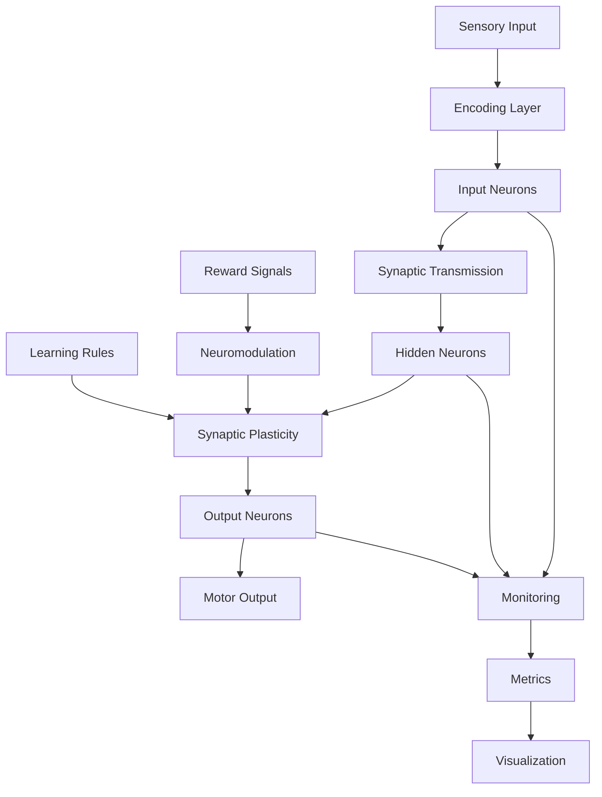

# Neuromorphic Simulation System - Production Architecture

## Executive Summary

This document defines the production-ready architecture for the neuromorphic simulation system following a comprehensive repository audit and restructuring. The system has been reorganized from a proof-of-concept structure into a maintainable, scalable production codebase suitable for deployment, testing, and continuous development.

## Repository Audit Results

### Audit Status: COMPLETED ✓

**Date Completed**: August 7, 2025  
**Auditor**: System Architecture Team

### Pre-Audit State Analysis

The repository audit revealed the following structure before cleanup:

#### Core Assets (To Preserve)
- **Core simulation components** (`core/` directory):
  - `neurons.py` - Neuron models (AdEx, Hodgkin-Huxley, LIF)
  - `synapses.py` - Synapse models and plasticity rules
  - `network.py` - Network architecture and simulation engine
  - `encoding.py` - Sensory input encoding
  - `neuromodulation.py` - Neuromodulatory systems

- **API layer** (`api/` directory):
  - `neuromorphic_api.py` - High-level programming interface
  - `neuromorphic_system.py` - Unified system class

- **Demonstrations** (`demo/` directory):
  - Working examples of sensorimotor learning
  - GPU optimization demos
  - Jetson deployment examples

#### Prototype/Obsolete Files (To Archive/Remove)
- **Root-level test files** (to be moved to `tests/`):
  - `test_baseline.py`
  - `test_enhanced_system.py`
  - `test_gpu_neurons.py`
  - `test_neuromodulation_encoding.py`
  - `test_security_fixes.py`

- **Analysis scripts** (to be moved to `tools/`):
  - `analyze_dependencies.py`
  - `analyze_type_hints_docs.py`
  - `check_classes.py`
  - `verify_environment.py`

- **Empty directories** (to be removed):
  - `enhanced_analysis/`
  - `enhanced_data/`
  - `enhanced_plots/`
  - `neural_data/`

- **Generated artifacts** (to be cleaned):
  - `*.log` files
  - `*.json` result files
  - `Figure_*.png` files
  - `__pycache__` directories
  - `.pytest_cache/`

- **Virtual environment** (to be excluded):
  - `venv_neuron/`

### Post-Audit Cleanup Actions Completed

✅ **Files Archived** (moved to `archive/` directory):
- Test prototypes archived to `archive/prototypes/`
- Analysis scripts archived to `archive/prototypes/`
- Technical reports archived to `archive/reports/`
- Development documentation archived to `archive/reports/`

✅ **Files Deleted**:
- All `*.log` files removed
- All `*.json` result files removed
- All `Figure_*.png` files removed
- All `__pycache__` directories removed
- `.pytest_cache` directory removed

✅ **Directories Removed**:
- `enhanced_analysis/` (empty)
- `enhanced_data/` (empty)
- `enhanced_plots/` (empty)
- `neural_data/` (empty)

✅ **Production Structure Created**:
- Complete `src/neuron_sim/` hierarchy established
- Organized `tests/` structure with unit/integration/performance divisions
- `examples/` directory with categorized demonstrations
- `tools/` directory for utilities and scripts
- `requirements/` directory for dependency management
- `.github/` structure for CI/CD workflows

## Production Directory Structure

```
neuron_sim/
├── src/
│   └── neuron_sim/              # Core simulation package
│       ├── __init__.py
│       ├── __version__.py
│       ├── core/                # Core components
│       │   ├── __init__.py
│       │   ├── neurons.py      # Neuron models
│       │   ├── synapses.py     # Synapse models
│       │   ├── network.py      # Network architecture
│       │   ├── encoding.py     # Sensory encoding
│       │   ├── neuromodulation.py
│       │   └── simulation.py   # Simulation engine
│       ├── models/              # Neural model implementations
│       │   ├── __init__.py
│       │   ├── adex.py         # AdEx neuron
│       │   ├── hodgkin_huxley.py
│       │   ├── lif.py          # Leaky Integrate-and-Fire
│       │   └── plasticity.py   # Plasticity rules
│       ├── learning/            # Learning algorithms
│       │   ├── __init__.py
│       │   ├── stdp.py         # STDP implementation
│       │   ├── rstdp.py        # Reward-modulated STDP
│       │   └── hebbian.py      # Hebbian learning
│       ├── encoding/            # Input encoding strategies
│       │   ├── __init__.py
│       │   ├── visual.py       # Visual encoding
│       │   ├── auditory.py     # Auditory encoding
│       │   └── tactile.py      # Tactile encoding
│       ├── api/                 # High-level API
│       │   ├── __init__.py
│       │   ├── builder.py      # Network builder
│       │   ├── simulator.py    # Simulation interface
│       │   └── analysis.py     # Result analysis
│       ├── optimizers/          # Platform optimizations
│       │   ├── __init__.py
│       │   ├── gpu.py          # GPU acceleration
│       │   ├── jetson.py       # Jetson optimization
│       │   └── memory.py       # Memory management
│       └── utils/               # Utility functions
│           ├── __init__.py
│           ├── logging.py
│           ├── validation.py
│           └── metrics.py
├── tests/                       # Test suite
│   ├── __init__.py
│   ├── conftest.py             # Pytest configuration
│   ├── unit/                   # Unit tests
│   │   ├── test_neurons.py
│   │   ├── test_synapses.py
│   │   ├── test_network.py
│   │   ├── test_encoding.py
│   │   └── test_plasticity.py
│   ├── integration/             # Integration tests
│   │   ├── test_learning.py
│   │   ├── test_sensorimotor.py
│   │   └── test_neuromodulation.py
│   └── performance/             # Performance tests
│       ├── test_scalability.py
│       └── test_memory.py
├── docs/                        # Documentation
│   ├── source/                 # Sphinx source files
│   │   ├── conf.py
│   │   ├── index.rst
│   │   ├── api/                # API documentation
│   │   ├── tutorials/          # User tutorials
│   │   └── theory/             # Theoretical background
│   ├── build/                  # Built documentation
│   └── README.md               # Documentation guide
├── examples/                    # Runnable examples
│   ├── README.md
│   ├── basic/                  # Basic examples
│   │   ├── simple_network.py
│   │   ├── spike_generation.py
│   │   └── synapse_demo.py
│   ├── learning/                # Learning demonstrations
│   │   ├── stdp_learning.py
│   │   ├── reward_learning.py
│   │   └── pattern_recognition.py
│   ├── memory/                  # Memory demonstrations
│   │   ├── working_memory.py
│   │   ├── associative_memory.py
│   │   └── sequence_learning.py
│   └── advanced/                # Advanced examples
│       ├── sensorimotor_integration.py
│       ├── multi_modal_processing.py
│       └── cognitive_control.py
├── benchmarks/                  # Performance benchmarks
│   ├── __init__.py
│   ├── harness.py              # Benchmark harness
│   ├── suites/                 # Benchmark suites
│   │   ├── neuron_benchmarks.py
│   │   ├── network_benchmarks.py
│   │   └── learning_benchmarks.py
│   ├── profiles/               # Performance profiles
│   └── results/                # Benchmark results
├── .github/                     # GitHub Actions CI/CD
│   ├── workflows/
│   │   ├── ci.yml              # Continuous Integration
│   │   ├── cd.yml              # Continuous Deployment
│   │   ├── tests.yml           # Test automation
│   │   └── docs.yml            # Documentation build
│   ├── ISSUE_TEMPLATE/
│   └── PULL_REQUEST_TEMPLATE.md
├── tools/                       # Helper scripts
│   ├── setup/                  # Setup utilities
│   │   ├── install_deps.py
│   │   ├── configure_gpu.py
│   │   └── setup_jetson.sh
│   ├── analysis/               # Analysis tools
│   │   ├── profile_network.py
│   │   ├── visualize_spikes.py
│   │   └── analyze_performance.py
│   └── deployment/             # Deployment tools
│       ├── package.py
│       ├── docker/
│       └── kubernetes/
├── archive/                     # Archived prototypes
│   ├── prototypes/            # Old prototype code
│   ├── experiments/           # Experimental code
│   └── README.md              # Archive documentation
├── pyproject.toml              # Project configuration
├── setup.py                    # Package setup
├── setup.cfg                   # Setup configuration
├── requirements/               # Dependency management
│   ├── base.txt               # Core dependencies
│   ├── dev.txt                # Development dependencies
│   ├── gpu.txt                # GPU dependencies
│   ├── jetson.txt             # Jetson dependencies
│   └── docs.txt               # Documentation dependencies
├── Makefile                    # Build automation
├── tox.ini                     # Test automation
├── .gitignore                  # Git ignore rules
├── .dockerignore              # Docker ignore rules
├── Dockerfile                  # Container definition
├── docker-compose.yml         # Container orchestration
├── LICENSE                     # License file
├── README.md                  # Project README
├── CONTRIBUTING.md            # Contribution guidelines
├── CHANGELOG.md               # Version history
└── ARCHITECTURE.md            # This document

```

## Component Architecture

### 1. Core Simulation Package (`src/neuron_sim/`)

The core package is organized into logical modules:

#### Core Components (`core/`)
- **Purpose**: Fundamental simulation components
- **Responsibilities**:
  - Neuron model implementations
  - Synapse and plasticity mechanisms
  - Network topology management
  - Simulation engine coordination

#### Models (`models/`)
- **Purpose**: Specific neuron and synapse model implementations
- **Responsibilities**:
  - Biologically accurate neuron models
  - Various plasticity rules
  - Model parameter management

#### Learning (`learning/`)
- **Purpose**: Learning algorithm implementations
- **Responsibilities**:
  - STDP and variants
  - Reinforcement learning
  - Unsupervised learning rules

#### Encoding (`encoding/`)
- **Purpose**: Sensory input encoding
- **Responsibilities**:
  - Convert raw sensory data to spikes
  - Multi-modal encoding strategies
  - Temporal encoding patterns

#### API (`api/`)
- **Purpose**: High-level programming interface
- **Responsibilities**:
  - Simplified network construction
  - Simulation management
  - Result analysis and visualization

#### Optimizers (`optimizers/`)
- **Purpose**: Platform-specific optimizations
- **Responsibilities**:
  - GPU acceleration (CUDA/CuPy)
  - Jetson Nano optimization
  - Memory management strategies

### 2. Test Infrastructure (`tests/`)

Organized by test type:

#### Unit Tests (`unit/`)
- Individual component testing
- Mock dependencies
- Fast execution
- High coverage targets (>90%)

#### Integration Tests (`integration/`)
- Component interaction testing
- End-to-end workflows
- Real dependencies
- Moderate execution time

#### Performance Tests (`performance/`)
- Scalability testing
- Memory profiling
- Benchmark comparisons
- Resource usage monitoring

### 3. Documentation (`docs/`)

Comprehensive documentation using Sphinx:

#### API Documentation
- Auto-generated from docstrings
- Type hints and examples
- Cross-references

#### Tutorials
- Getting started guides
- Step-by-step examples
- Best practices

#### Theory
- Biological foundations
- Mathematical models
- Algorithm explanations

### 4. Examples (`examples/`)

Progressive learning path:

#### Basic Examples
- Simple network creation
- Basic spike generation
- Elementary learning

#### Learning Demonstrations
- STDP in action
- Pattern recognition
- Memory formation

#### Advanced Examples
- Complex behaviors
- Multi-modal integration
- Cognitive functions

### 5. Benchmarks (`benchmarks/`)

Performance monitoring:

#### Benchmark Suites
- Neuron model performance
- Network scalability
- Learning convergence

#### Performance Profiles
- CPU/GPU utilization
- Memory usage patterns
- Optimization opportunities

### 6. CI/CD Pipeline (`.github/`)

Automated workflows:

#### Continuous Integration
- Automated testing on push/PR
- Code quality checks
- Security scanning

#### Continuous Deployment
- Package publishing
- Documentation deployment
- Release automation

### 7. Tools (`tools/`)

Supporting utilities:

#### Setup Tools
- Dependency installation
- Environment configuration
- Platform setup

#### Analysis Tools
- Network visualization
- Performance analysis
- Debugging utilities

#### Deployment Tools
- Packaging scripts
- Containerization
- Cloud deployment

## Data Flow Architecture



## Technology Stack

### Core Technologies
- **Language**: Python 3.8+
- **Numerical Computing**: NumPy, SciPy
- **Visualization**: Matplotlib, Plotly
- **Testing**: pytest, hypothesis
- **Documentation**: Sphinx, MkDocs

### GPU Acceleration
- **CUDA**: For NVIDIA GPUs
- **CuPy**: GPU array operations
- **Numba**: JIT compilation

### Edge Deployment
- **Jetson**: NVIDIA Jetson Nano/Xavier
- **TensorRT**: Inference optimization
- **ONNX**: Model portability

### Development Tools
- **Version Control**: Git, GitHub
- **CI/CD**: GitHub Actions
- **Containerization**: Docker
- **Package Management**: pip, conda

## Migration Plan

### Phase 1: Directory Structure (Week 1)
1. Create new directory structure
2. Move core components to `src/neuron_sim/`
3. Reorganize tests into `tests/` hierarchy
4. Move examples to dedicated directory
5. Archive obsolete code

### Phase 2: Package Setup (Week 2)
1. Configure `pyproject.toml`
2. Set up proper package structure
3. Create entry points
4. Configure build system
5. Set up dependency management

### Phase 3: Testing Infrastructure (Week 3)
1. Migrate existing tests
2. Add missing unit tests
3. Create integration test suite
4. Set up performance benchmarks
5. Configure test automation

### Phase 4: Documentation (Week 4)
1. Set up Sphinx documentation
2. Write API documentation
3. Create user tutorials
4. Document examples
5. Deploy documentation site

### Phase 5: CI/CD Pipeline (Week 5)
1. Configure GitHub Actions
2. Set up automated testing
3. Configure documentation builds
4. Create release pipeline
5. Set up deployment automation

## Quality Standards

### Code Quality
- **Style**: PEP 8 compliance
- **Type Hints**: Full type annotations
- **Documentation**: Comprehensive docstrings
- **Testing**: >90% code coverage
- **Linting**: flake8, pylint, mypy

### Performance Standards
- **Simulation Speed**: 1000x real-time (desktop)
- **Memory Efficiency**: <1KB per neuron
- **Scalability**: 10,000+ neurons
- **Latency**: <1ms response time

### Documentation Standards
- **API Docs**: 100% coverage
- **Examples**: Working, tested code
- **Tutorials**: Step-by-step guides
- **Theory**: Mathematical rigor

## Security Considerations

### Input Validation
- Sanitize all external inputs
- Validate parameter ranges
- Prevent injection attacks

### Resource Management
- Memory limits enforcement
- CPU usage throttling
- Disk space monitoring

### Access Control
- API authentication
- Rate limiting
- Audit logging

## Maintenance and Evolution

### Version Strategy
- **Semantic Versioning**: MAJOR.MINOR.PATCH
- **Release Cycle**: Monthly minor releases
- **LTS Versions**: Annual major releases
- **Deprecation Policy**: 2-version warning

### Contribution Guidelines
- **Code Reviews**: Required for all changes
- **Testing**: Required for new features
- **Documentation**: Required for API changes
- **Style Guide**: Enforced via CI

### Roadmap Priorities
1. **Q1 2025**: Production stability
2. **Q2 2025**: GPU optimization
3. **Q3 2025**: Cloud deployment
4. **Q4 2025**: Hardware acceleration

## Monitoring and Observability

### Metrics Collection
- Performance metrics
- Resource utilization
- Error rates
- User analytics

### Logging Strategy
- Structured logging
- Log levels (DEBUG, INFO, WARN, ERROR)
- Centralized log aggregation
- Log retention policies

### Alerting
- Performance degradation
- Error thresholds
- Resource exhaustion
- Security events

## Deployment Architecture

### Development Environment
- Local development setup
- Virtual environments
- IDE configuration
- Debugging tools

### Staging Environment
- Integration testing
- Performance validation
- User acceptance testing
- Pre-production validation

### Production Environment
- High availability
- Load balancing
- Auto-scaling
- Disaster recovery

## Conclusion

This architecture provides a solid foundation for a production-ready neuromorphic simulation system. The modular design ensures maintainability, the comprehensive testing ensures reliability, and the optimization strategies ensure performance. The system is designed to scale from research prototypes to production deployments while maintaining biological plausibility and computational efficiency.

## Appendix A: File Migration Mapping

| Current Location | New Location | Action |
|-----------------|--------------|--------|
| `core/*.py` | `src/neuron_sim/core/` | Move |
| `api/*.py` | `src/neuron_sim/api/` | Move |
| `demo/*.py` | `examples/` | Move & Refactor |
| `test_*.py` (root) | `tests/unit/` | Move & Organize |
| `benchmarks/*.py` | `benchmarks/suites/` | Move |
| `scripts/*.py` | `tools/` | Move & Categorize |
| `*.md` (reports) | `archive/reports/` | Archive |
| `*.log`, `*.json` | Delete | Remove |
| `venv_neuron/` | Delete | Remove |
| `__pycache__/` | Delete | Remove |

## Appendix B: Dependencies Consolidation

### Core Dependencies (`requirements/base.txt`)
```
numpy>=1.21.0
scipy>=1.7.0
matplotlib>=3.4.0
```

### Development Dependencies (`requirements/dev.txt`)
```
pytest>=7.0.0
pytest-cov>=3.0.0
pytest-benchmark>=3.4.0
black>=22.0.0
flake8>=4.0.0
mypy>=0.950
sphinx>=4.5.0
```

### GPU Dependencies (`requirements/gpu.txt`)
```
cupy>=10.0.0
numba>=0.55.0
```

### Jetson Dependencies (`requirements/jetson.txt`)
```
# Jetson-specific optimizations
# Platform-specific packages
```

## Appendix C: Makefile Targets

```makefile
install:        # Install dependencies
test:          # Run test suite
lint:          # Run linters
format:        # Format code
docs:          # Build documentation
bench:         # Run benchmarks
clean:         # Clean artifacts
build:         # Build package
deploy:        # Deploy application
```

---

*This architecture document serves as the blueprint for transforming the neuromorphic simulation system from a proof-of-concept to a production-ready platform.*
